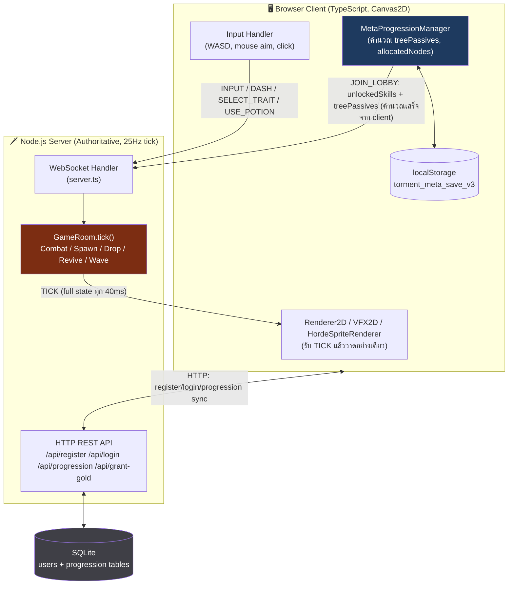
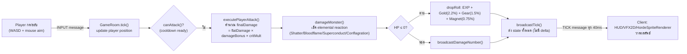
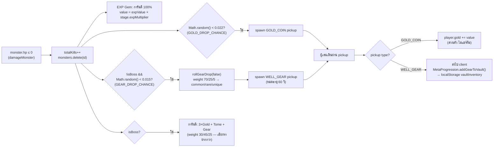
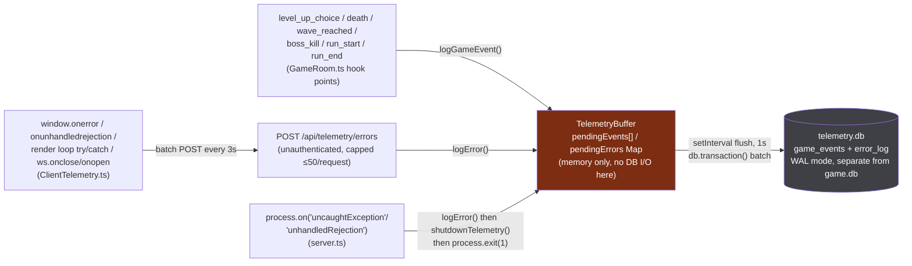
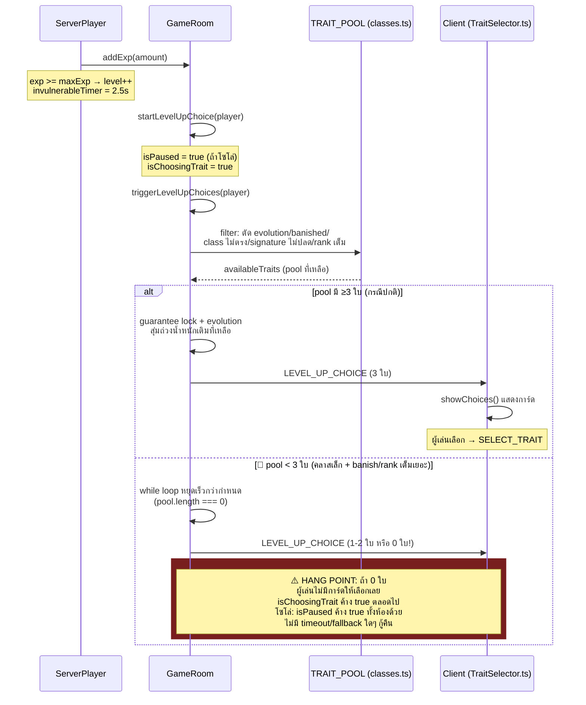
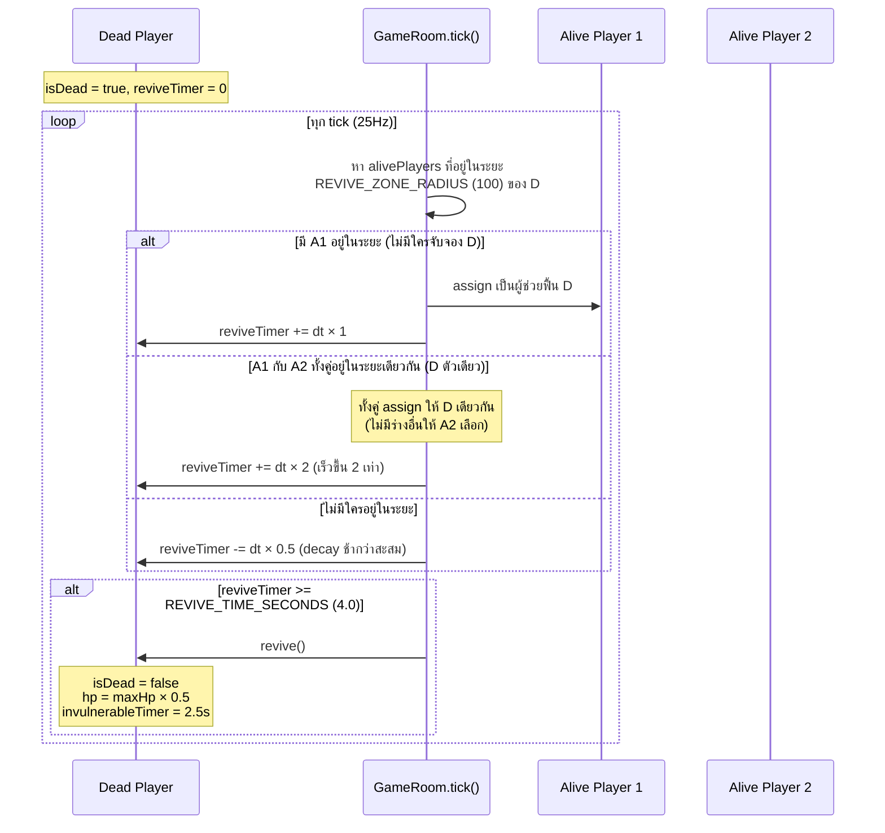
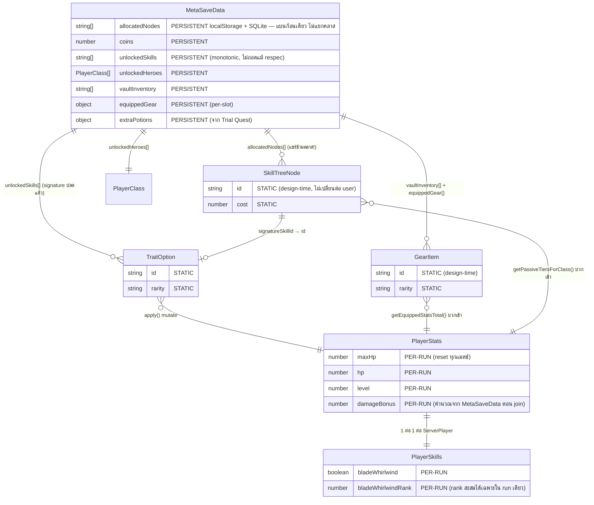

# 🗺️ GAME_BLUEPRINT — เอกสารพัฒนาเกม & Refactor Roadmap

> ต่อยอดจาก [`GAME_WIKI.md`](./GAME_WIKI.md) (ฐานข้อมูลอ้างอิงจาก source code จริง) — เอกสารนี้ไม่วิเคราะห์ซ้ำสิ่งที่ WIKI มีอยู่แล้ว แต่ใช้เป็น**เอกสารพัฒนา + blueprint ที่วางแผน refactor/ต่อยอดฟีเจอร์ได้จริง** ทุก diagram/ตัวเลขอ้างอิงจาก flow/data ที่มีหลักฐานใน source เท่านั้น
>
> **ภาคผนวก (raw data เต็ม ไม่ตัดทอน)**: [`APPENDIX_SKILLTREE.md`](./APPENDIX_SKILLTREE.md) (skill tree ทุก node ทุกคลาส) · [`APPENDIX_TRAITPOOL.md`](./APPENDIX_TRAITPOOL.md) (TRAIT_POOL ทุกใบ + probability คำนวณเต็ม)

## Change Log

| วันที่ | สรุปสิ่งที่เปลี่ยน | เหตุผล/อ้างอิง commit หรือ prompt ที่สั่ง |
|---|---|---|
| 2026-09-11 | สร้างเอกสารครั้งแรก (Architecture Overview, DFD, Sequence Diagram, ER Diagram, Refactor Roadmap, Known Design Decisions) | คำสั่ง user: ยกระดับจาก GAME_WIKI.md เป็นเอกสารพัฒนา + blueprint |
| 2026-09-11 | Round 1 functional bugfix: mark Refactor Roadmap #3,6,9,11,12 เป็น ✅ แก้แล้ว, #7 เป็น ⚠️ false positive (ไม่ต้องแก้) | `docs/archive/2026-09-11-round1-functional-bugfixes.md` |
| 2026-09-11 | พบและแก้ risk ใหม่ #19 (projectile z-order bug) เพิ่มใน Refactor Roadmap Phase 1 | `docs/archive/2026-09-11-projectile-zorder-fix.md` |
| 2026-09-11 | Fix B: ELITE_GOLEM Ground Slam เปลี่ยนจาก telegraph-free เป็น 2-phase (0.4s warning ring) — sync กับ GAME_WIKI.md §3.3 | `docs/archive/2026-09-11-projectile-zorder-fix.md` |
| 2026-09-11 | พบและแก้ risk ใหม่ #20 (IMP hitbox radius 12→16) เพิ่มใน Refactor Roadmap Phase 1 | `docs/archive/2026-09-11-imp-hitbox-fix.md` |
| 2026-09-11 | พบและแก้ risk ใหม่ #21 ("Return to Hub" หลังบอสตายทำเกมค้าง) เพิ่มใน Refactor Roadmap Phase 1 | `docs/archive/2026-09-11-return-to-hub-victory-trap-fix.md` |
| 2026-09-11 | Risk audit หลังแก้ #21: เปลี่ยนเป็น ack-based + พบและแก้ risk ใหม่ #22 (`requireAuth` ไม่เช็ค user ยังมีอยู่จริง) เพิ่มใน Refactor Roadmap Phase 1 | `docs/archive/2026-09-11-return-to-hub-victory-trap-fix.md` |
| 2026-09-11 | เพิ่มระบบ Telemetry & Error Logging ใหม่ทั้งระบบ — เพิ่ม Flow 4 (B.2), telemetry ER entities (B.4), Refactor Roadmap Phase 3 items ใหม่ #23-25 (B.5), Known Design Decisions 2 ข้อใหม่เรื่อง no-auth endpoint + crash-then-exit (B.6) | `docs/archive/2026-09-11-telemetry-error-logging.md` |
| 2026-09-11 | Risk audit หลังพัฒนา telemetry (user ขอ "ลดความเสี่ยงให้ต่ำที่สุด"): #23 no-auth endpoint ลดความเสี่ยงด้วย rate limit, เพิ่ม `run_end` ให้ co-op surrender, เพิ่ม `checkMonsterSanity()` — renumber Roadmap #23-24 เดิม (retention/dashboard) เป็น #24-25 ให้ตรงกับ GAME_WIKI.md (เจอ numbering ไม่ตรงกันระหว่าง 2 เอกสารตอน sync รอบนี้ แก้ให้ตรงแล้ว) | `docs/archive/2026-09-11-telemetry-error-logging.md` |
| 2026-09-12 | เพิ่ม Telemetry Dashboard (แก้ Roadmap #25) — พบและแก้ stored-XSS จริงระหว่างทดสอบ (draft แรก render error message ผ่าน `innerHTML`) เพิ่ม Known Design Decision เรื่อง `ADMIN_SECRET` แยกจาก `JWT_SECRET` | `docs/archive/2026-09-11-telemetry-error-logging.md` |
| 2026-09-12 | Dashboard เปิดไม่ได้หลัง deploy จริง — route เดิมอยู่นอก `/api/` ที่ nginx proxy มา Node เลยโดน SPA catch-all ของ game client เสิร์ฟหน้า login แทนเงียบๆ ย้าย route เป็น `/api/admin/telemetry/dashboard` | `docs/archive/2026-09-11-telemetry-error-logging.md` |
| 2026-09-12 | เพิ่ม `location /admin/` block ใน nginx site config บน production ตามที่ user ขอ (URL สะอาดกว่า) ย้าย dashboard route กลับมาที่ `/admin/telemetry` เพิ่ม Roadmap #26 (nginx config ไม่ได้อยู่ใน git) | `docs/archive/2026-09-11-telemetry-error-logging.md` |
| 2026-09-12 | Dashboard เป็นภาษาไทยเป็นหลัก (ตรวจโค้ดเกมก่อนแปลให้ตรงของเดิม) + เพิ่มระบบ System Metrics (host/process CPU/RAM, entity ใหม่ `system_metrics` — B.4) พบ edge case จาก unit test ใน `computeProcessCpuPercent()` แก้แล้ว (ดู GAME_WIKI.md §5.7.2) | `docs/archive/2026-09-11-telemetry-error-logging.md` |
>
> สร้างเมื่อ 2026-09-11

## สารบัญ

- [B.1 System Architecture Overview](#b1-system-architecture-overview)
- [B.2 Data Flow Diagram (Level-1)](#b2-data-flow-diagram-level-1)
- [B.3 Sequence Diagrams — Flow ที่มี Stability Risk เกี่ยวข้อง](#b3-sequence-diagrams--flow-ที่มี-stability-risk-เกี่ยวข้อง)
- [B.4 ER-style Diagram — โครงสร้างข้อมูลหลัก](#b4-er-style-diagram--โครงสร้างข้อมูลหลัก)
- [B.5 Refactor Roadmap](#b5-refactor-roadmap)
- [B.6 Known Design Decisions](#b6-known-design-decisions-แยกจาก-risk)

---

## B.1 System Architecture Overview

### Context Diagram

### Authority Model — ใครคำนวณอะไร

| ส่วน | คำนวณที่ไหน | Trust Boundary |
|---|---|---|
| Combat resolution (ดาเมจ, crit, armor formula, elemental reaction) | **Server เท่านั้น** (`GameRoom.ts`) | ✅ ปลอดภัย client ส่งได้แค่ input (aim angle, isAttacking) |
| Monster AI, spawn, wave scaling, drop roll | **Server เท่านั้น** (`HordeDirector.ts`, `GameRoom.ts`) | ✅ ปลอดภัย |
| Revive contention/timer | **Server เท่านั้น** (`GameRoom.tick()`) | ✅ ปลอดภัย |
| **Skill Tree allocation decision** (จะซื้อ node ไหน) | Client (`MetaProgressionManager.allocateNode()`) | ⚠️ เก็บใน localStorage + sync ไป server ผ่าน `/api/progression` |
| **Skill Tree effect → ตัวเลขสถิติจริง** (`treePassives`) | **Client คำนวณเสร็จเอง** (`getPassiveTiersForClass()`) แล้วส่งเลขสำเร็จรูปให้ server | 🔴 **Server เชื่อโดยไม่ re-derive** — ดู GAME_WIKI §1.10 Risk #1 |
| Meta save ทั้งก้อน (coins, allocatedNodes, vaultInventory, unlockedHeroes) | Client เก็บ localStorage เป็นหลัก, sync ไป SQLite ผ่าน `/api/progression` | 🔴 **Server เก็บ blob โดยไม่ validate schema เลย** (ดูรายละเอียดด้านล่าง) |

**หลักฐานสำคัญที่ GAME_WIKI.md ยังไม่ได้บันทึกไว้** — comment ใน `src/server/db.ts:78-81` และ `src/server/server.ts:329-330` ยืนยันว่านี่เป็น**การตัดสินใจที่ตั้งใจไว้แล้ว** ไม่ใช่ความประมาท:

> *"Intentionally not schema-validated (see db.ts setProgression comment) — this project's current friend-testing scale doesn't warrant an anti-cheat check on your own save data."*

พูดง่ายๆ คือ ทีมงานรู้อยู่แล้วว่าไม่มีการตรวจสอบ และเลือกที่จะไม่ทำในเฟส friend-testing — ข้อมูลนี้เปลี่ยนวิธีจัดลำดับความสำคัญใน B.5 (ไม่ใช่ "ลืมทำ" แต่เป็น "รู้แล้วเลื่อนไว้ก่อน")

---

## B.2 Data Flow Diagram (Level-1)

### Flow 1 — Player Input → Combat Resolution → Damage/Death → Client Render

### Flow 2 — Skill Tree Allocation (client) → JOIN_LOBBY → Server Apply → ServerPlayer Stats

```mermaid
flowchart LR
    A["ผู้เล่นกด Allocate Node<br/>(SkillTreeUI.ts)"] --> B["canAllocateNode()<br/>เช็ค: เหรียญพอ? unlock hero แล้ว?<br/>ต่อกับ neighbor ที่ allocate แล้ว?"]
    B -->|ผ่าน| C["allocatedNodes.push(id)<br/>save() → localStorage"]
    C --> D["recomputeSignatures()<br/>สแกนหา signatureSkillId ทั้งหมด"]
    D --> E["getPassiveTiersForClass(class)<br/>วน tree ของคลาส + universal<br/>รวม increased/more + gear stats"]
    E -->|"JOIN_LOBBY {unlockedSkills, treePassives}"| F["server.ts เก็บลง client.treePassives<br/>(ไม่มีการ re-derive/validate)"]
    F --> G["GameRoom.addPlayer()<br/>→ initSkillTreeUnlocks()"]
    G --> H["ServerPlayer.stats<br/>maxHp/defense/damageBonus/...<br/>ถูก apply ตรงจากตัวเลขที่ client ส่งมา"]

    style F fill:#7c2d12,color:#fff
    style H fill:#7c2d12,color:#fff
```

### Flow 3 — Monster Death → Drop Roll (2-stage) → Loot Spawn → Pickup → Vault/Gold

### Flow 4 — Telemetry Capture (server + client) → Buffer → Batched Flush → telemetry.db

**หมายเหตุ**: `POST /api/telemetry/events` (คู่กับ `/errors`) มีอยู่จริงและทดสอบผ่าน curl แล้ว แต่ไม่มี
arrow เข้าในไดอะแกรมนี้เพราะยังไม่มี client code เรียกใช้จริงในรอบนี้ — capture point ทั้ง 6 ของ
`game_events` เป็น server-authoritative ล้วน (ดู GAME_WIKI.md §5.7)

---

## B.3 Sequence Diagrams — Flow ที่มี Stability Risk เกี่ยวข้อง

### 3.1 Level-Up Choice Flow (โยง GAME_WIKI §4.7 Risk #1 — pool ว่างเปล่า)

### 3.2 Revive Flow (contention-based, ไม่มี stability risk ระดับสูง แต่แสดงเพื่อความสมบูรณ์)

---

## B.4 ER-style Diagram — โครงสร้างข้อมูลหลัก

**หมายเหตุจุดสำคัญ** (สอดคล้อง GAME_WIKI §1.7):
- **`MetaSaveData.allocatedNodes` เป็น shared pool ข้ามคลาส** — ไม่มี field แยกเช่น `allocatedNodes.swordsman` vs `allocatedNodes.archer` ทุกคลาสอ่าน array เดียวกัน (เห็นชัดในไดอะแกรมข้างบนว่า relationship เป็น `MetaSaveData ||--o{ SkillTreeNode` เส้นเดียว ไม่แตกตาม PlayerClass)
- **`PlayerStats`/`PlayerSkills` เป็น per-run ล้วน** — สร้างใหม่ทุกครั้งที่ `ServerPlayer` constructor ทำงาน (ตอน join match) ค่าที่เห็นระหว่างเล่นหายหมดตอนจบเกม สิ่งที่ persist ต่อคือ **ผลลัพธ์** (coins ที่ได้, kills ที่นับ) ไม่ใช่ state ระหว่างเล่น
- **`SkillTreeNode`/`GearItem`/`TraitOption` เป็น static design-time data** — เหมือนกันทุก user ไม่มีการเปลี่ยนแปลงต่อ instance (ต่างจาก 3 entity ข้างบนที่เป็น per-user data)

**Telemetry entities (แยก DB, ไม่รวมในไดอะแกรมข้างบน)** — `game_events`/`error_log` อยู่คนละไฟล์
(`telemetry.db`) จาก entity ทั้งหมดข้างบน (`game.db`) โดยสิ้นเชิง ไม่มี FK เชื่อมกันจริงระดับ DB
(`run_id`/`player_id` เป็น soft-correlation ระดับ application logic เท่านั้น ไม่ enforce):
- `game_events` — `run_id` (generate ที่ `GameRoom.start()` ด้วย `crypto.randomUUID()`), `player_id`
  nullable (room-level event เช่น `run_start`/`wave_reached`/`boss_kill` ไม่ผูก player),
  `event_type`, `payload` (TEXT, JSON.stringify ต่อ event_type — ดู GAME_WIKI.md §5.7)
- `error_log` — unique ด้วย `signature_hash` เท่านั้น ไม่มี FK ไปที่ entity อื่นเลย (`source`/`category`
  เป็น string ล้วน) — ดู GAME_WIKI.md §5.7 สำหรับ dedup logic เต็ม
- `system_metrics` (ใหม่ 2026-09-12) — ไม่ผูกกับ run/player เลย เป็น time-series ล้วน (host+process
  CPU/RAM ทุก 30 วิ) เขียนตรงไม่ผ่าน `TelemetryBuffer` (ความถี่ต่ำพอที่ synchronous insert ไม่กระทบ
  performance) — ดู GAME_WIKI.md §5.7.2

---

## B.5 Refactor Roadmap

แปลงจาก **Top Stability Risks** ใน `GAME_WIKI.md` §6 เป็นแผนงานจริง จัดกลุ่มตาม Phase

### Phase 1 — แก้ก่อนด่วน (ก่อนเปิดกว้างเกินกลุ่ม friend-testing)

| # | Risk (อ้าง WIKI) | แนวทางแก้ | Effort | Dependency |
|---|---|---|---|---|
| 1 | Server ไม่ validate `treePassives`/สถิติจาก client (§1.10) | Server re-derive `treePassives` เองจาก `allocatedNodes` ที่เก็บใน SQLite (`getProgression(userId)`) แทนที่จะเชื่อค่าใน `JOIN_LOBBY` payload ตรงๆ — ต้อง port `getPassiveTiersForClass()`'s logic (หรือเรียก shared function เดียวกัน) ไปรันฝั่ง server ได้ด้วย เพราะปัจจุบันฟังก์ชันนี้อยู่ใน `src/client/engine/MetaProgression.ts` (client-only) | **L** — ต้องแยก pure-function logic ออกมาเป็น shared module (`src/shared/`) ที่ทั้ง client และ server import ได้, แก้ `GameRoom.addPlayer()`/`initSkillTreeUnlocks()` ให้ดึงจาก server-side re-derive แทน, ต้องมี user↔deviceId↔account mapping ที่แน่นอน (ตรวจสอบว่าปัจจุบัน guest/ไม่ login เล่นได้ไหม — ถ้าได้ต้องมี fallback) | ไม่มี dependency ต่อ risk อื่น แต่เป็น**ฐาน**ที่ทำให้ Phase 1-2 ที่เหลือมั่นใจได้ว่าข้อมูลถูกต้อง |
| 2 | `/api/progression` POST ไม่ validate schema เลย (พบเพิ่มจาก `db.ts`/`server.ts` comment, เกี่ยวโยง #1) | เพิ่ม schema validation ขั้นต่ำ: เช็คว่าทุก id ใน `allocatedNodes` มีอยู่จริงใน `CLASS_SKILL_TREES`, เช็คว่า `coins` ไม่ติดลบ/ไม่เกินขีดที่เป็นไปได้ตาม `totalKills`/playtime — **หมายเหตุ: ทีมงานรู้อยู่แล้วและตั้งใจเลื่อนไว้ก่อนสำหรับ friend-testing scale (มี comment ยืนยันชัดเจน) — ไม่ใช่ bug ที่ "ลืม" ควรถามทีมก่อนว่าจะยกระดับตอนนี้เลยหรือรอจนใกล้เปิดกว้างจริง** | **M** | ควรทำหลัง #1 เพราะใช้ schema/logic เดียวกันบางส่วน |
| 3 | ✅ **แก้แล้ว 2026-09-11** — ~~`triggerLevelUpChoices()` อาจส่ง choices ว่างเปล่า, ไม่มี fallback~~ (§4.7) | ใช้แนวทางต่างจากที่วางแผนไว้เล็กน้อย: แทนที่จะส่งการ์ด "OK" ให้กดเปล่าๆ เปลี่ยนเป็นส่ง message ใหม่ `LEVEL_UP_SKIPPED` (heal 25% max HP เป็น consolation) แล้ว resolve pick ให้อัตโนมัติทันทีผ่าน `finishLevelUpChoice()` — ไม่ต้องให้ผู้เล่นกดอะไรเพิ่ม | **S** — `GameRoom.ts`, `main.ts`, `types.ts` | เสร็จแล้ว |
| 4 | TICK message ไม่มี delta compression (§5.6) | เริ่มจาก quick win ก่อน full delta system: ตัด field ที่ไม่เปลี่ยนบ่อย (เช่น player name/class) ออกจาก payload รายทิก ส่งแค่ตอนเปลี่ยนจริง; ระยะยาวค่อยทำ delta/interest-management (ส่งเฉพาะ entity ในระยะ viewport ของแต่ละผู้เล่น) | **L** (ระยะยาว) / **S** (quick win เบื้องต้น) | ไม่ต้องรอ risk อื่น แต่ควรวัด (profiling) ก่อนว่า payload จริงใหญ่แค่ไหนที่ wave ท้ายๆ ก่อนลงทุนแก้ใหญ่ |
| 19 | ✅ **แก้แล้ว 2026-09-11 (พบใหม่ นอกเหนือ 18 ข้อเดิม)** — ~~กระสุนถูกวาดใต้ฝูงมอนสเตอร์ (client z-order bug)~~ (§3.7) | พบจาก user report "ตายไม่รู้สาเหตุตอนลาสบอสด่าน 2" — `main.ts` วาด `vfx.render()` (กระสุนทุกชนิด) ก่อน `hordeRenderer.render()` เสมอ กระสุนที่วิ่งผ่าน/เกิดใกล้ฝูงมอน (380+ ตัวช่วงเวฟท้าย) ถูกวาดทับจนมองไม่เห็น หนักสุดที่ LORD_OF_TORMENT (Void Barrage 5 ลูก + Summon Reinforcements ล้อมตัวเอง) แก้โดยแยก `VFX2D.render()` เป็น `renderGround()`/`renderOverlay()` แล้วย้ายกระสุน+particle ไปวาดหลังฝูงมอน | **S** — `VFX2D.ts`, `main.ts` | เสร็จแล้ว |
| 20 | ✅ **แก้แล้ว 2026-09-11 (พบใหม่ นอกเหนือ 19 ข้อเดิม)** — ~~IMP hitbox เล็กกว่า sprite ที่วาดมาก~~ (§3.7) | พบจาก user report "ธนู archer โดนตัวค้างคาวแต่ไม่โดน dmg เลย" — `MONSTER_STATS[IMP].radius` เดิม 12 เล็กที่สุดในเกม ขณะ sprite วาดคงที่ 64×64px ไม่ผูกกับ radius เลย รวมกับ arrow radius 10 ได้ combined hit เพียง 22px ปรับเป็น 16 (เท่า SKELETON) | **S** — `constants.ts` (ค่าเดียว, ไหลผ่าน `ServerMonster.radius` อัตโนมัติ) | เสร็จแล้ว |
| 21 | ✅ **แก้แล้ว 2026-09-11 (พบใหม่ นอกเหนือ 20 ข้อเดิม)** — ~~"Return to Hub" หลังบอสตายทำเกมค้าง (`victoryPending` ไม่เคยตั้ง `isOver`)~~ (§5.6) | พบจาก user report "กดกลับสู่เกมหลังจบบอสแล้วเกมค้าง ต้องกดยอมแพ้เพื่อออก" — `victoryPending=true` freeze โลกรอเลือก Continue แต่ไม่เคยตั้ง `isOver=true`, client เดิมกด Return แค่ reload เฉยๆ ไม่แจ้ง server ทำให้ `JOIN_LOBBY` resume-check ลากกลับเข้าห้องเดิมที่ยัง freeze อยู่ (เกิดทั้ง solo/coop) — comment ใน `handleSurrender()` เคยอธิบาย/แก้ bug class เดียวกันไว้แล้วสำหรับปุ่มยอมแพ้ แต่ไม่เคยพอร์ตมาใช้กับ flow ชนะบอส แก้ด้วย `handleReturnToHub()` คู่ขนาน (ไม่มี gold penalty/ไม่ resend GAME_OVER) + message `RETURN_TO_HUB` ใหม่ + ack round-trip (`RETURN_TO_HUB_ACK`, fallback timeout 800ms) ก่อน reload — เดิมใช้ fixed delay 150ms, เปลี่ยนเป็น ack-based หลัง risk audit เพราะไม่มี guarantee message หลุดออกจริงก่อน reload | **S** — `types.ts`, `constants.ts`, `GameRoom.ts`, `server.ts`, `HUD.ts`, `main.ts` | เสร็จแล้ว |
| 22 | ✅ **แก้แล้ว 2026-09-11 (พบใหม่ นอกเหนือ 21 ข้อเดิม, ระหว่าง manual test ของ #21)** — ~~`requireAuth()` ไม่เช็คว่า user ยังมีอยู่จริง — `POST /api/progression` พังแบบ unhandled 500 ถ้า token เก่ากว่า DB~~ (§5.6) | คนละ root cause กับ #21 — `requireAuth()` เช็คแค่ JWT signature ไม่เคยเช็คว่า `uid` ยังมีแถวอยู่จริงใน `users` (TOKEN_TTL 30 วัน, dev DB ถูกล้าง/สร้างใหม่ได้) `GET` ไม่พังเพราะ SELECT เฉยๆ แต่ `POST`'s INSERT มี FOREIGN KEY เลย throw unhandled `SqliteError` แก้โดยเพิ่ม `findUserById(payload.uid)` ตอบ 401 ถ้าไม่พบ แทน exception — ไม่มี unit test เพิ่ม (`server.ts` ไม่มี test harness ในโปรเจกต์ — import จะเริ่ม HTTP+WS listener จริงทันที) ยืนยันด้วย manual E2E (500→401 ทั้ง log และ network tab) | **S** — `server.ts` | เสร็จแล้ว |

### Phase 2 — แก้ก่อนขยายฟีเจอร์ใหญ่ (โดยเฉพาะก่อนเพิ่ม skill tree/trait ใหม่จำนวนมาก)

| # | Risk | แนวทางแก้ | Effort | Dependency |
|---|---|---|---|---|
| 5 | Magic number กระจายใน `ServerPlayer.takeDamage()` (§1.10) | ย้ายโบนัสเกราะจากสกิล (blessedAegis/ironRetaliation/astralAegis/chonkArmor) เข้าไปเป็นส่วนหนึ่งของ `PlayerSkills` rank calculation ที่มี named constant แทน hardcode ตรงจุด | **M** | ไม่มี dependency |
| 6 | ✅ **แก้แล้ว 2026-09-11** — ~~`LOCK`/`BANISH` ไม่ validate ว่า `traitId` อยู่ในตัวเลือกปัจจุบัน~~ (§4.7) | ตรงตามแผน + เพิ่มเติม: `ServerPlayer.currentTraitChoiceIds` cache ตามแผน แต่ `handleSelectTrait` (ไม่ใช่แค่ potion) ก็ validate ด้วยเช่นกัน พร้อมตรวจคลาส/signature-unlock/rank ซ้ำอีกชั้น (defense-in-depth ตามที่ user อนุมัติ) | **S** | เสร็จแล้ว |
| 7 | ⚠️ **Correction 2026-09-11** — ~~Superconduct chain lightning recursive ไม่มี guard~~ (§5.6) | ตรวจสอบก่อนแก้พบว่า**ไม่ใช่บั๊กจริง**: chain damage call ไม่ส่ง `sourceElement` param อยู่แล้ว ทำให้ reaction block ไม่ทำงานกับเป้าหมายที่โดน chain — ไม่ recurse จริง ไม่ต้องแก้อะไร | — | ไม่ต้องทำ (false positive) |
| 8 | โค้ดสร้าง JOIN_LOBBY payload/addPlayer ซ้ำหลายจุด (§1.10) | สร้าง helper function เดียว `buildJoinLobbyPayload()` (client) และ `resolveNewPlayer(client)` (server) แทนโค้ดซ้ำ 4+3 จุด | **M** | ควรทำ**หลัง** #1 เสร็จ เพราะ #1 จะเปลี่ยนรูปแบบ payload อยู่แล้ว ทำพร้อมกันจะคุ้มกว่า — **ยังไม่แก้** |
| 9 | ✅ **แก้แล้ว 2026-09-11** — ~~Race condition potion action ซ้อนกัน~~ (§4.7) | ยืนยันตรงตามที่แผนนี้คาดไว้เป๊ะ: **client-only fix เพียงพอจริง** (Node.js single-thread, `ws.on('message')` เป็น synchronous ไม่มี await) — เพิ่ม `isPotionActionPending` flag ใน `TraitSelector.ts` gate ปุ่ม REROLL/BANISH/LOCK ระหว่างรอ response แทน (ไม่ได้แก้ที่ `ServerPlayer` เพราะ server-side flag พิสูจน์แล้วว่าเป็น dead code ในสถาปัตยกรรม synchronous ปัจจุบัน) | **S** (client-only) | เสร็จแล้ว |
| 10 | Tier weight/multiplier เป็น magic number (§4.7) | ย้าย `TIER_WEIGHT`/`TIER_LUCK_SENSITIVITY`/`TIER_POWER_MULTIPLIER` ไปเป็น export จาก config file แยก (เช่น `balanceConfig.ts`) ที่ปรับได้โดยไม่ต้องแตะ logic file | **S** | ไม่มี dependency — แต่ทำก่อนจะเพิ่มการ์ดใหม่จำนวนมากจะง่ายกว่า — **ยังไม่แก้** |
| 11 | ✅ **แก้แล้ว 2026-09-11** — ~~`ServerMonster.update()` ไม่เช็ค target ยังมีชีวิตอยู่~~ (§3.7) | ใช้แนวทางต่างจากที่วางแผนไว้: caller (`GameRoom.ts`) เลือก target ที่ถูกต้อง (alive player ใกล้สุด) อยู่แล้วจริงตามที่ทายไว้ — แต่การแสดงออกจริงของ risk นี้คือกรณี**ไม่มีผู้เล่นที่ยังมีชีวิตเลย** caller default `targetX/Y = monster.x/y` ทำให้ `dist=0` หารด้วยศูนย์ แก้ที่ `ServerMonster.update()` โดยตรงด้วย guard `dist > 1e-6` แทนการเช็ค `!isDead` ที่ caller (แก้ที่จุดคำนวณจริง ครอบคลุมกรณีอื่นที่ dist=0 ได้ด้วย ไม่ใช่แค่ target ตาย) | **S** | เสร็จแล้ว |

### Phase 3 — Technical Debt ระยะยาว (ไม่เร่งด่วน)

| # | Risk | แนวทางแก้ | Effort |
|---|---|---|---|
| 12 | ✅ **แก้แล้ว 2026-09-11** — ~~Rarity `'magic'` นิยามไว้แต่ไม่มีไอเทมใช้~~ (§2.6) | ใช้แนวทางต่างจากที่วางแผนไว้ (ไม่เพิ่มไอเทมจริง/ไม่ลบ type — เก็บ `'magic'` ไว้เผื่ออนาคต): `getRandomGearOfRarity()` fallback ไป `'common'` + `console.warn` เมื่อ tier ว่าง กันไม่ให้คืน `undefined` เงียบๆ | **S** |
| 13 | Naming ไม่ตรงกัน `SkillTreeNode.stats` vs `GearItem.stats` (§1.10) | Migrate `GearItem.stats` ให้ใช้ naming เดียวกับ `PlayerStats` (breaking change ต่อ save data เก่า ต้องมี migration script) | **M** |
| 14 | `pickMonsterType()` เป็น if-chain ไม่ใช่ data table (§3.7) | Refactor เป็น weighted table แบบเดียวกับ `rollGearDrop()` | **M** |
| 15 | TRAIT_POOL count comment ล้าสมัย (§4.7) | แก้ comment ให้ตรงกับ 70 ใบจริง | **S** (แก้ comment บรรทัดเดียว) |
| 16 | สองระบบคำศัพท์คู่ขนาน rarity/tier (§4.7) | เอกสาร/ไม่ต้องแก้โค้ด — เพิ่ม comment อธิบาย mapping ให้ชัดในที่เดียว | **S** |
| 17 | Duplicated "nearest player" logic ใน boss abilities (§3.7) | Extract helper `findNearestAlivePlayer(monster, alivePlayers)` ใช้ร่วมกัน 4 จุด | **S** |
| 18 | vaultInventory ไม่มี cap (§2.6) | เพิ่ม `MAX_VAULT_SIZE` constant + เช็คก่อน push (ถ้าต้องการ) | **S** |
| 23 | ✅ **ลดความเสี่ยงแล้ว 2026-09-11** — ~~`/api/telemetry/events`/`/errors` ไม่มี auth เลย~~ (§5.8, ใหม่) | เพิ่ม `isTelemetryRateLimited()` (`server.ts`) — 40 req/60วิ ต่อ IP แยก limiter จาก `auth.ts`'s login limiter (threshold คนละแบบ) คู่กับ payload cap เดิม — ทดสอบผ่าน curl (40×200 ตามด้วย 429 ต่อเนื่อง) ยืนยันแล้ว | **S** — เสร็จแล้ว |
| 24 | `telemetry.db` ไม่มี retention/prune policy (§5.8, ใหม่) | เพิ่ม cron/startup job ลบ `game_events`/`error_log` เก่ากว่า N วัน (N ยังไม่กำหนด — รอ user ตัดสินใจ retention window) | **S** — ยังไม่ทำ ตั้งใจเลื่อนไว้ก่อนตามที่ระบุใน spec |
| 25 | ✅ **แก้แล้ว 2026-09-12** — ~~ไม่มี dashboard อ่าน telemetry~~ (§5.7.1, §5.8) | `GET /admin/telemetry` (static page — deploy แรกไปที่ path นี้ตรงๆ พังเพราะ nginx ไม่เคย proxy `/admin/` มา Node, ย้ายไป `/api/` ชั่วคราว, สุดท้ายเพิ่ม `location /admin/` ใหม่ใน nginx site config แล้วย้ายกลับมา) + `GET /api/admin/telemetry/summary` (auth: `ADMIN_SECRET` header) — ระหว่างทดสอบพบ stored-XSS จริง (draft แรก render error message ผ่าน `innerHTML` จาก endpoint ที่ไม่มี auth) แก้เป็น `textContent` + เพิ่ม whitelist validation ที่ ingest endpoint | **M** — เสร็จแล้ว |
| 26 | nginx site config ไม่ได้อยู่ใน git repo (§5.8, ใหม่) | พิจารณาเก็บ `/etc/nginx/sites-available/default` (หรือ template ของมัน) ไว้ใน repo เป็นเอกสารอ้างอิงอย่างน้อย กัน routing พังเงียบๆ ซ้ำถ้า server ถูกสร้างใหม่/config ถูก revert | **S** (แค่ copy ไฟล์เข้า repo ก็พอสำหรับตอนนี้) — ยังไม่ทำ |

---

## B.6 Known Design Decisions (แยกจาก Risk)

จุดเหล่านี้ **ยืนยันจาก comment ในโค้ดหรือ commit message ว่าเป็นการตัดสินใจที่ตั้งใจ** ไม่ใช่บั๊ก — กันไม่ให้ dev คนอื่นเข้าใจผิดแล้วไป "แก้" สิ่งที่ทำงานตามที่ออกแบบไว้:

- **Gear drop เป็น 2-stage independent roll ไม่ใช่ weighted table เดียว** (GAME_WIKI §2.4) — "ดรอปไหม" กับ "หายากแค่ไหน" เป็นคนละ roll ตั้งใจให้ EXP Gem/Gold/Gear/Magnet ดรอปพร้อมกันได้ในการฆ่าครั้งเดียว ไม่ต้องรวมกันเป็น 100%
- **Gear ห้ามมาจาก Trial Quest (achievement) เด็ดขาด** (GAME_WIKI §2.5) — comment ยืนยันตรงๆ: "equipment must only ever come from monster drops during a run, never from a one-time account-wide achievement"
- **HELLHOUND เร็วกว่าผู้เล่นทุกคน (speed 210)** (GAME_WIKI §3.7) — ตั้งใจให้วิ่งหนีเฉยๆ ไม่รอด ถึงเพิ่งเพิ่ม Hellfire Spit (ranged) ให้เพื่อไม่ให้ "kite ฟรี" ได้
- **`teamGold` เริ่มที่ 0 ทุกแมตช์เสมอ** (GAME_WIKI §5.4) — เคยมีบั๊กแจกฟรี 35,000 ตอนเริ่มเกม (testing-phase artifact) ถูกถอดออกแล้วอย่างตั้งใจ ไม่ใช่ regression
- **`/api/grant-gold` ไม่มี auth** (พบใน B.1) — เป็น GM command สำหรับแจกเหรียญช่วง friend-testing ตั้งใจเปิดไว้แบบนี้ (ยืนยันจาก memory ของโปรเจกต์: "no-auth gold API kept intentionally as GM command")
- **`/api/progression` ไม่ validate schema** (พบใหม่ใน B.1) — ตั้งใจเลื่อนไว้ก่อนสำหรับ scale ปัจจุบัน (friend-testing) มี comment ยืนยันชัดเจนทั้งใน `server.ts` และ `db.ts`
- **Skill Tree เป็น account-wide/shared ข้ามคลาส ไม่ใช่ per-character** (GAME_WIKI §1.7) — ทุกฮีโร่แชร์ `allocatedNodes` เดียวกัน เป็นดีไซน์ตั้งใจของระบบปัจจุบัน (ผู้ใช้เคยถามเรื่อง per-character level แยกไว้เป็นข้อเสนอแยกต่างหาก ยังไม่ได้ตัดสินใจทำ)
- **Reroll/Banish/Lock potion เริ่มที่ 0 ต้องปลดผ่าน Skill Tree** (GAME_WIKI §4.6) — เปลี่ยนจากฟรีทุกคนเป็นต้องลงทุนแล้ว ตั้งใจ ผู้เล่นเก่าจะเหลือ 0 ทันทีหลังอัพเดต ไม่ใช่บั๊ก
- **`/api/telemetry/events`/`/errors` ไม่มี auth** (GAME_WIKI §5.7-5.8, ใหม่) — ตั้งใจตามที่ user อนุมัติตอน spec approval ให้สอดคล้องกับ `/api/grant-gold` เดิม (ไม่ใช่ `/api/progression`'s `requireAuth()` pattern) เพราะ guest ที่ยังไม่ login ก็ต้อง report telemetry/error ได้ — ป้องกันด้วย payload cap (≤50 items/request, string cap 4000 ตัวอักษร) **+** per-IP rate limit (40 req/60วิ, เพิ่มหลัง risk audit 2026-09-11) แทน auth
- **`process.on('uncaughtException'/'unhandledRejection')` ต้อง `process.exit(1)` เสมอหลัง log telemetry** (GAME_WIKI §5.7, ใหม่) — ไม่ใช่ทางเลือก: การเพิ่ม handler พวกนี้เข้ามาเลย (ไม่เคยมีมาก่อนในโปรเจกต์) ทำให้ Node หยุด exit อัตโนมัติตามดีฟอลต์ ถ้าไม่เรียก `process.exit(1)` เองจะกลายเป็นรันต่อในสถานะ process ที่อาจพังแล้วไปเรื่อยๆ แทนที่จะ crash-restart ผ่าน pm2 เหมือนพฤติกรรมเดิม — `shutdownTelemetry()` (synchronous flush) ต้องเกิดก่อน `exit()` เสมอ กันรายงาน crash หายไปพร้อม process
- **Telemetry dashboard ใช้ `ADMIN_SECRET` แยกจาก `JWT_SECRET` โดยสิ้นเชิง** (GAME_WIKI §5.7.1, ใหม่) — ไม่ผูกกับระบบ login ผู้เล่นเพราะ `users` table ไม่มี role/admin field เลยตั้งแต่ต้น การเพิ่ม field นั้นเข้าไปเฉพาะสำหรับ internal tool ตัวเดียวถือว่า over-engineer เกินจำเป็นสำหรับ scale ปัจจุบัน — เลือก pattern เดียวกับ `JWT_SECRET`/insecure-dev-default แทน

---

*เอกสารนี้อ้างอิงจาก source code จริง ณ วันที่ 2026-09-11 ร่วมกับ `GAME_WIKI.md` — หากโค้ดเปลี่ยนแปลงหลังจากนี้ควรตรวจสอบซ้ำก่อนใช้วางแผนจริง*
