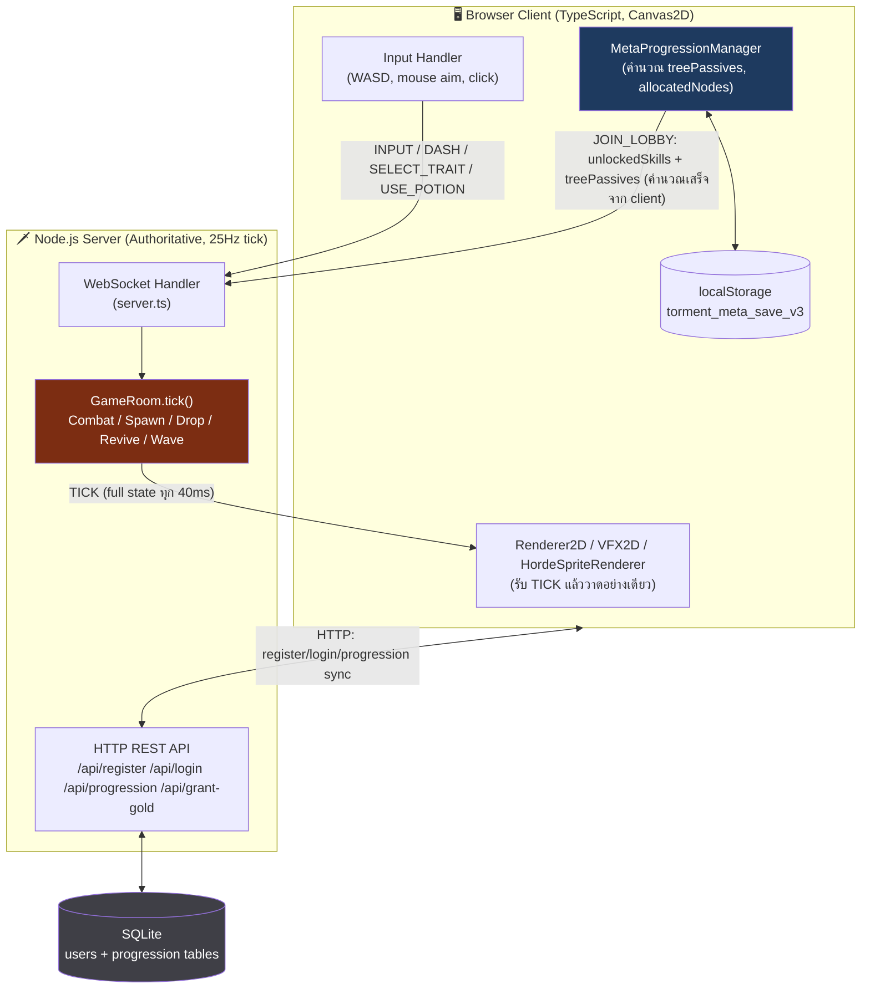
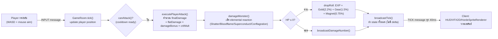
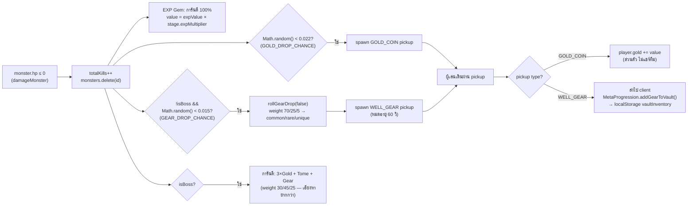
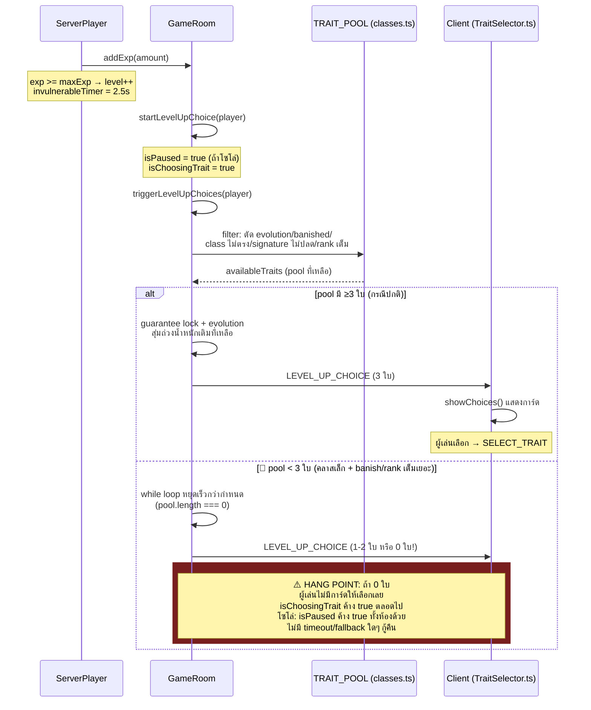
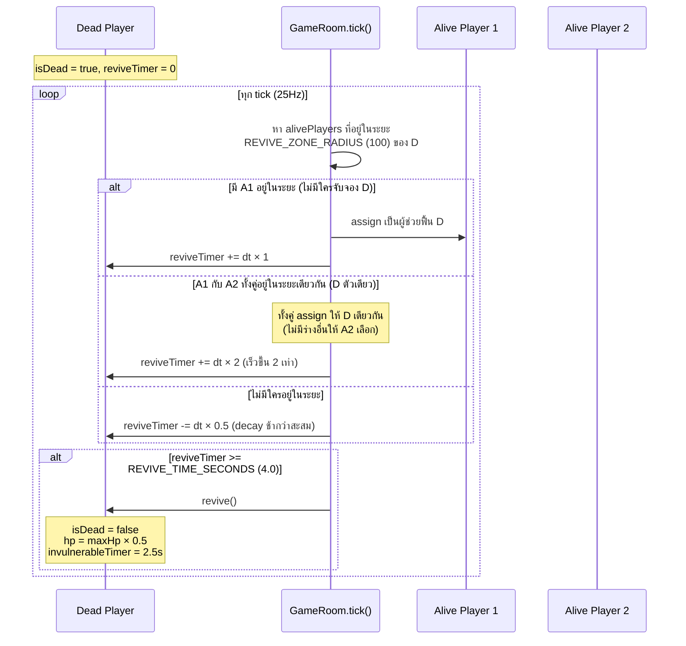
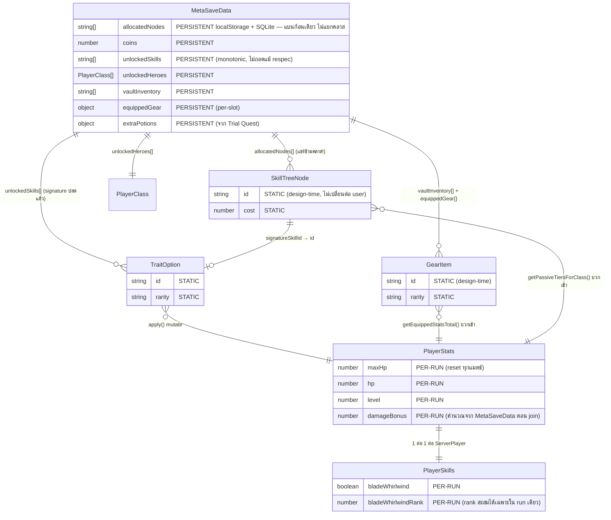

# 🗺️ GAME_BLUEPRINT — เอกสารพัฒนาเกม & Refactor Roadmap

> ต่อยอดจาก [`GAME_WIKI.md`](./GAME_WIKI.md) (ฐานข้อมูลอ้างอิงจาก source code จริง) — เอกสารนี้ไม่วิเคราะห์ซ้ำสิ่งที่ WIKI มีอยู่แล้ว แต่ใช้เป็น**เอกสารพัฒนา + blueprint ที่วางแผน refactor/ต่อยอดฟีเจอร์ได้จริง** ทุก diagram/ตัวเลขอ้างอิงจาก flow/data ที่มีหลักฐานใน source เท่านั้น
>
> **ภาคผนวก (raw data เต็ม ไม่ตัดทอน)**: [`APPENDIX_SKILLTREE.md`](./APPENDIX_SKILLTREE.md) (skill tree ทุก node ทุกคลาส) · [`APPENDIX_TRAITPOOL.md`](./APPENDIX_TRAITPOOL.md) (TRAIT_POOL ทุกใบ + probability คำนวณเต็ม)

## Change Log

| วันที่ | สรุปสิ่งที่เปลี่ยน | เหตุผล/อ้างอิง commit หรือ prompt ที่สั่ง |
|---|---|---|
| 2026-09-11 | สร้างเอกสารครั้งแรก (Architecture Overview, DFD, Sequence Diagram, ER Diagram, Refactor Roadmap, Known Design Decisions) | คำสั่ง user: ยกระดับจาก GAME_WIKI.md เป็นเอกสารพัฒนา + blueprint |
>
> สร้างเมื่อ 2026-09-11

## สารบัญ

- [B.1 System Architecture Overview](#b1-system-architecture-overview)
- [B.2 Data Flow Diagram (Level-1)](#b2-data-flow-diagram-level-1)
- [B.3 Sequence Diagrams — Flow ที่มี Stability Risk เกี่ยวข้อง](#b3-sequence-diagrams--flow-ที่มี-stability-risk-เกี่ยวข้อง)
- [B.4 ER-style Diagram — โครงสร้างข้อมูลหลัก](#b4-er-style-diagram--โครงสร้างข้อมูลหลัก)
- [B.5 Refactor Roadmap](#b5-refactor-roadmap)
- [B.6 Known Design Decisions](#b6-known-design-decisions-แยกจาก-risk)

---

## B.1 System Architecture Overview

### Context Diagram

### Authority Model — ใครคำนวณอะไร

| ส่วน | คำนวณที่ไหน | Trust Boundary |
|---|---|---|
| Combat resolution (ดาเมจ, crit, armor formula, elemental reaction) | **Server เท่านั้น** (`GameRoom.ts`) | ✅ ปลอดภัย client ส่งได้แค่ input (aim angle, isAttacking) |
| Monster AI, spawn, wave scaling, drop roll | **Server เท่านั้น** (`HordeDirector.ts`, `GameRoom.ts`) | ✅ ปลอดภัย |
| Revive contention/timer | **Server เท่านั้น** (`GameRoom.tick()`) | ✅ ปลอดภัย |
| **Skill Tree allocation decision** (จะซื้อ node ไหน) | Client (`MetaProgressionManager.allocateNode()`) | ⚠️ เก็บใน localStorage + sync ไป server ผ่าน `/api/progression` |
| **Skill Tree effect → ตัวเลขสถิติจริง** (`treePassives`) | **Client คำนวณเสร็จเอง** (`getPassiveTiersForClass()`) แล้วส่งเลขสำเร็จรูปให้ server | 🔴 **Server เชื่อโดยไม่ re-derive** — ดู GAME_WIKI §1.10 Risk #1 |
| Meta save ทั้งก้อน (coins, allocatedNodes, vaultInventory, unlockedHeroes) | Client เก็บ localStorage เป็นหลัก, sync ไป SQLite ผ่าน `/api/progression` | 🔴 **Server เก็บ blob โดยไม่ validate schema เลย** (ดูรายละเอียดด้านล่าง) |

**หลักฐานสำคัญที่ GAME_WIKI.md ยังไม่ได้บันทึกไว้** — comment ใน `src/server/db.ts:78-81` และ `src/server/server.ts:329-330` ยืนยันว่านี่เป็น**การตัดสินใจที่ตั้งใจไว้แล้ว** ไม่ใช่ความประมาท:

> *"Intentionally not schema-validated (see db.ts setProgression comment) — this project's current friend-testing scale doesn't warrant an anti-cheat check on your own save data."*

พูดง่ายๆ คือ ทีมงานรู้อยู่แล้วว่าไม่มีการตรวจสอบ และเลือกที่จะไม่ทำในเฟส friend-testing — ข้อมูลนี้เปลี่ยนวิธีจัดลำดับความสำคัญใน B.5 (ไม่ใช่ "ลืมทำ" แต่เป็น "รู้แล้วเลื่อนไว้ก่อน")

---

## B.2 Data Flow Diagram (Level-1)

### Flow 1 — Player Input → Combat Resolution → Damage/Death → Client Render

### Flow 2 — Skill Tree Allocation (client) → JOIN_LOBBY → Server Apply → ServerPlayer Stats

```mermaid
flowchart LR
    A["ผู้เล่นกด Allocate Node<br/>(SkillTreeUI.ts)"] --> B["canAllocateNode()<br/>เช็ค: เหรียญพอ? unlock hero แล้ว?<br/>ต่อกับ neighbor ที่ allocate แล้ว?"]
    B -->|ผ่าน| C["allocatedNodes.push(id)<br/>save() → localStorage"]
    C --> D["recomputeSignatures()<br/>สแกนหา signatureSkillId ทั้งหมด"]
    D --> E["getPassiveTiersForClass(class)<br/>วน tree ของคลาส + universal<br/>รวม increased/more + gear stats"]
    E -->|"JOIN_LOBBY {unlockedSkills, treePassives}"| F["server.ts เก็บลง client.treePassives<br/>(ไม่มีการ re-derive/validate)"]
    F --> G["GameRoom.addPlayer()<br/>→ initSkillTreeUnlocks()"]
    G --> H["ServerPlayer.stats<br/>maxHp/defense/damageBonus/...<br/>ถูก apply ตรงจากตัวเลขที่ client ส่งมา"]

    style F fill:#7c2d12,color:#fff
    style H fill:#7c2d12,color:#fff
```

### Flow 3 — Monster Death → Drop Roll (2-stage) → Loot Spawn → Pickup → Vault/Gold

---

## B.3 Sequence Diagrams — Flow ที่มี Stability Risk เกี่ยวข้อง

### 3.1 Level-Up Choice Flow (โยง GAME_WIKI §4.7 Risk #1 — pool ว่างเปล่า)

### 3.2 Revive Flow (contention-based, ไม่มี stability risk ระดับสูง แต่แสดงเพื่อความสมบูรณ์)

---

## B.4 ER-style Diagram — โครงสร้างข้อมูลหลัก

**หมายเหตุจุดสำคัญ** (สอดคล้อง GAME_WIKI §1.7):
- **`MetaSaveData.allocatedNodes` เป็น shared pool ข้ามคลาส** — ไม่มี field แยกเช่น `allocatedNodes.swordsman` vs `allocatedNodes.archer` ทุกคลาสอ่าน array เดียวกัน (เห็นชัดในไดอะแกรมข้างบนว่า relationship เป็น `MetaSaveData ||--o{ SkillTreeNode` เส้นเดียว ไม่แตกตาม PlayerClass)
- **`PlayerStats`/`PlayerSkills` เป็น per-run ล้วน** — สร้างใหม่ทุกครั้งที่ `ServerPlayer` constructor ทำงาน (ตอน join match) ค่าที่เห็นระหว่างเล่นหายหมดตอนจบเกม สิ่งที่ persist ต่อคือ **ผลลัพธ์** (coins ที่ได้, kills ที่นับ) ไม่ใช่ state ระหว่างเล่น
- **`SkillTreeNode`/`GearItem`/`TraitOption` เป็น static design-time data** — เหมือนกันทุก user ไม่มีการเปลี่ยนแปลงต่อ instance (ต่างจาก 3 entity ข้างบนที่เป็น per-user data)

---

## B.5 Refactor Roadmap

แปลงจาก **Top Stability Risks** ใน `GAME_WIKI.md` §6 เป็นแผนงานจริง จัดกลุ่มตาม Phase

### Phase 1 — แก้ก่อนด่วน (ก่อนเปิดกว้างเกินกลุ่ม friend-testing)

| # | Risk (อ้าง WIKI) | แนวทางแก้ | Effort | Dependency |
|---|---|---|---|---|
| 1 | Server ไม่ validate `treePassives`/สถิติจาก client (§1.10) | Server re-derive `treePassives` เองจาก `allocatedNodes` ที่เก็บใน SQLite (`getProgression(userId)`) แทนที่จะเชื่อค่าใน `JOIN_LOBBY` payload ตรงๆ — ต้อง port `getPassiveTiersForClass()`'s logic (หรือเรียก shared function เดียวกัน) ไปรันฝั่ง server ได้ด้วย เพราะปัจจุบันฟังก์ชันนี้อยู่ใน `src/client/engine/MetaProgression.ts` (client-only) | **L** — ต้องแยก pure-function logic ออกมาเป็น shared module (`src/shared/`) ที่ทั้ง client และ server import ได้, แก้ `GameRoom.addPlayer()`/`initSkillTreeUnlocks()` ให้ดึงจาก server-side re-derive แทน, ต้องมี user↔deviceId↔account mapping ที่แน่นอน (ตรวจสอบว่าปัจจุบัน guest/ไม่ login เล่นได้ไหม — ถ้าได้ต้องมี fallback) | ไม่มี dependency ต่อ risk อื่น แต่เป็น**ฐาน**ที่ทำให้ Phase 1-2 ที่เหลือมั่นใจได้ว่าข้อมูลถูกต้อง |
| 2 | `/api/progression` POST ไม่ validate schema เลย (พบเพิ่มจาก `db.ts`/`server.ts` comment, เกี่ยวโยง #1) | เพิ่ม schema validation ขั้นต่ำ: เช็คว่าทุก id ใน `allocatedNodes` มีอยู่จริงใน `CLASS_SKILL_TREES`, เช็คว่า `coins` ไม่ติดลบ/ไม่เกินขีดที่เป็นไปได้ตาม `totalKills`/playtime — **หมายเหตุ: ทีมงานรู้อยู่แล้วและตั้งใจเลื่อนไว้ก่อนสำหรับ friend-testing scale (มี comment ยืนยันชัดเจน) — ไม่ใช่ bug ที่ "ลืม" ควรถามทีมก่อนว่าจะยกระดับตอนนี้เลยหรือรอจนใกล้เปิดกว้างจริง** | **M** | ควรทำหลัง #1 เพราะใช้ schema/logic เดียวกันบางส่วน |
| 3 | `triggerLevelUpChoices()` อาจส่ง choices ว่างเปล่า, ไม่มี fallback (§4.7) | เพิ่ม fallback ที่ท้ายฟังก์ชัน: ถ้า `selectedTraits.length === 0` หลังลูปจบ ให้สร้างการ์ด "ไม่มีตัวเลือกเพิ่มเติม กด OK เพื่อดำเนินเกมต่อ" (ไม่ apply อะไร) แทนที่จะไม่ส่งอะไรเลย และปลด `isPaused`/`isChoosingTrait` เองถ้าจำเป็น | **S** — จุดแก้เดียวใน `triggerLevelUpChoices()` + เพิ่ม client-side rendering เคสนี้ใน `TraitSelector.ts` | ไม่มี dependency |
| 4 | TICK message ไม่มี delta compression (§5.6) | เริ่มจาก quick win ก่อน full delta system: ตัด field ที่ไม่เปลี่ยนบ่อย (เช่น player name/class) ออกจาก payload รายทิก ส่งแค่ตอนเปลี่ยนจริง; ระยะยาวค่อยทำ delta/interest-management (ส่งเฉพาะ entity ในระยะ viewport ของแต่ละผู้เล่น) | **L** (ระยะยาว) / **S** (quick win เบื้องต้น) | ไม่ต้องรอ risk อื่น แต่ควรวัด (profiling) ก่อนว่า payload จริงใหญ่แค่ไหนที่ wave ท้ายๆ ก่อนลงทุนแก้ใหญ่ |

### Phase 2 — แก้ก่อนขยายฟีเจอร์ใหญ่ (โดยเฉพาะก่อนเพิ่ม skill tree/trait ใหม่จำนวนมาก)

| # | Risk | แนวทางแก้ | Effort | Dependency |
|---|---|---|---|---|
| 5 | Magic number กระจายใน `ServerPlayer.takeDamage()` (§1.10) | ย้ายโบนัสเกราะจากสกิล (blessedAegis/ironRetaliation/astralAegis/chonkArmor) เข้าไปเป็นส่วนหนึ่งของ `PlayerSkills` rank calculation ที่มี named constant แทน hardcode ตรงจุด | **M** | ไม่มี dependency |
| 6 | `LOCK`/`BANISH` ไม่ validate ว่า `traitId` อยู่ในตัวเลือกปัจจุบัน (§4.7) | เพิ่มเช็คใน `handleUsePotion()`: `traitId` ต้องอยู่ใน player's last-sent choices set (เก็บ cache ล่าสุดไว้ใน `ServerPlayer`) | **S** | ควรทำพร้อม #3 (แก้ในไฟล์เดียวกัน `handleUsePotion`/`triggerLevelUpChoices`) |
| 7 | Superconduct chain lightning recursive ไม่มี guard (§5.6) | เพิ่ม `Set<monsterId>` ที่ track ว่าตัวไหน trigger reaction แล้วในเฟรมนี้ ส่งต่อผ่าน parameter กันไม่ให้ recursive call ตัวเดิมซ้ำ | **S** | ไม่มี dependency |
| 8 | โค้ดสร้าง JOIN_LOBBY payload/addPlayer ซ้ำหลายจุด (§1.10) | สร้าง helper function เดียว `buildJoinLobbyPayload()` (client) และ `resolveNewPlayer(client)` (server) แทนโค้ดซ้ำ 4+3 จุด | **M** | ควรทำ**หลัง** #1 เสร็จ เพราะ #1 จะเปลี่ยนรูปแบบ payload อยู่แล้ว ทำพร้อมกันจะคุ้มกว่า |
| 9 | Race condition potion action ซ้อนกัน (§4.7) | เพิ่ม `isProcessingPotionAction` flag ชั่วคราวใน `ServerPlayer` ปฏิเสธ action ใหม่ถ้ายัง process อันเก่าไม่เสร็จ (ในทางปฏิบัติ Node.js เป็น single-thread อยู่แล้ว ปัญหาจริงคือ double-send จาก client ก่อน UI disable ปุ่ม → แก้ฝั่ง client ก็เพียงพอ: disable ปุ่มทันทีที่กด รอ response ก่อนเปิดใหม่) | **S** (client-only fix เพียงพอ) | ไม่มี dependency |
| 10 | Tier weight/multiplier เป็น magic number (§4.7) | ย้าย `TIER_WEIGHT`/`TIER_LUCK_SENSITIVITY`/`TIER_POWER_MULTIPLIER` ไปเป็น export จาก config file แยก (เช่น `balanceConfig.ts`) ที่ปรับได้โดยไม่ต้องแตะ logic file | **S** | ไม่มี dependency — แต่ทำก่อนจะเพิ่มการ์ดใหม่จำนวนมากจะง่ายกว่า |
| 11 | `ServerMonster.update()` ไม่เช็ค target ยังมีชีวิตอยู่ (§3.7) | เพิ่มพารามิเตอร์/เช็คใน caller (`GameRoom.ts`) ก่อนเรียก `update()` ว่า target player `!isDead` เสมอ (ปัจจุบันน่าจะบังเอิญไม่พังเพราะ caller เลือก target ที่ถูกต้องอยู่แล้ว แต่ไม่มี defensive check ในชั้นใน) | **S** | ไม่มี dependency |

### Phase 3 — Technical Debt ระยะยาว (ไม่เร่งด่วน)

| # | Risk | แนวทางแก้ | Effort |
|---|---|---|---|
| 12 | Rarity `'magic'` นิยามไว้แต่ไม่มีไอเทมใช้ (§2.6) | เพิ่มไอเทม magic tier จริง หรือลบ type ออกให้ตรงกับที่ใช้ | **S** |
| 13 | Naming ไม่ตรงกัน `SkillTreeNode.stats` vs `GearItem.stats` (§1.10) | Migrate `GearItem.stats` ให้ใช้ naming เดียวกับ `PlayerStats` (breaking change ต่อ save data เก่า ต้องมี migration script) | **M** |
| 14 | `pickMonsterType()` เป็น if-chain ไม่ใช่ data table (§3.7) | Refactor เป็น weighted table แบบเดียวกับ `rollGearDrop()` | **M** |
| 15 | TRAIT_POOL count comment ล้าสมัย (§4.7) | แก้ comment ให้ตรงกับ 70 ใบจริง | **S** (แก้ comment บรรทัดเดียว) |
| 16 | สองระบบคำศัพท์คู่ขนาน rarity/tier (§4.7) | เอกสาร/ไม่ต้องแก้โค้ด — เพิ่ม comment อธิบาย mapping ให้ชัดในที่เดียว | **S** |
| 17 | Duplicated "nearest player" logic ใน boss abilities (§3.7) | Extract helper `findNearestAlivePlayer(monster, alivePlayers)` ใช้ร่วมกัน 4 จุด | **S** |
| 18 | vaultInventory ไม่มี cap (§2.6) | เพิ่ม `MAX_VAULT_SIZE` constant + เช็คก่อน push (ถ้าต้องการ) | **S** |

---

## B.6 Known Design Decisions (แยกจาก Risk)

จุดเหล่านี้ **ยืนยันจาก comment ในโค้ดหรือ commit message ว่าเป็นการตัดสินใจที่ตั้งใจ** ไม่ใช่บั๊ก — กันไม่ให้ dev คนอื่นเข้าใจผิดแล้วไป "แก้" สิ่งที่ทำงานตามที่ออกแบบไว้:

- **Gear drop เป็น 2-stage independent roll ไม่ใช่ weighted table เดียว** (GAME_WIKI §2.4) — "ดรอปไหม" กับ "หายากแค่ไหน" เป็นคนละ roll ตั้งใจให้ EXP Gem/Gold/Gear/Magnet ดรอปพร้อมกันได้ในการฆ่าครั้งเดียว ไม่ต้องรวมกันเป็น 100%
- **Gear ห้ามมาจาก Trial Quest (achievement) เด็ดขาด** (GAME_WIKI §2.5) — comment ยืนยันตรงๆ: "equipment must only ever come from monster drops during a run, never from a one-time account-wide achievement"
- **HELLHOUND เร็วกว่าผู้เล่นทุกคน (speed 210)** (GAME_WIKI §3.7) — ตั้งใจให้วิ่งหนีเฉยๆ ไม่รอด ถึงเพิ่งเพิ่ม Hellfire Spit (ranged) ให้เพื่อไม่ให้ "kite ฟรี" ได้
- **`teamGold` เริ่มที่ 0 ทุกแมตช์เสมอ** (GAME_WIKI §5.4) — เคยมีบั๊กแจกฟรี 35,000 ตอนเริ่มเกม (testing-phase artifact) ถูกถอดออกแล้วอย่างตั้งใจ ไม่ใช่ regression
- **`/api/grant-gold` ไม่มี auth** (พบใน B.1) — เป็น GM command สำหรับแจกเหรียญช่วง friend-testing ตั้งใจเปิดไว้แบบนี้ (ยืนยันจาก memory ของโปรเจกต์: "no-auth gold API kept intentionally as GM command")
- **`/api/progression` ไม่ validate schema** (พบใหม่ใน B.1) — ตั้งใจเลื่อนไว้ก่อนสำหรับ scale ปัจจุบัน (friend-testing) มี comment ยืนยันชัดเจนทั้งใน `server.ts` และ `db.ts`
- **Skill Tree เป็น account-wide/shared ข้ามคลาส ไม่ใช่ per-character** (GAME_WIKI §1.7) — ทุกฮีโร่แชร์ `allocatedNodes` เดียวกัน เป็นดีไซน์ตั้งใจของระบบปัจจุบัน (ผู้ใช้เคยถามเรื่อง per-character level แยกไว้เป็นข้อเสนอแยกต่างหาก ยังไม่ได้ตัดสินใจทำ)
- **Reroll/Banish/Lock potion เริ่มที่ 0 ต้องปลดผ่าน Skill Tree** (GAME_WIKI §4.6) — เปลี่ยนจากฟรีทุกคนเป็นต้องลงทุนแล้ว ตั้งใจ ผู้เล่นเก่าจะเหลือ 0 ทันทีหลังอัพเดต ไม่ใช่บั๊ก

---

*เอกสารนี้อ้างอิงจาก source code จริง ณ วันที่ 2026-09-11 ร่วมกับ `GAME_WIKI.md` — หากโค้ดเปลี่ยนแปลงหลังจากนี้ควรตรวจสอบซ้ำก่อนใช้วางแผนจริง*
